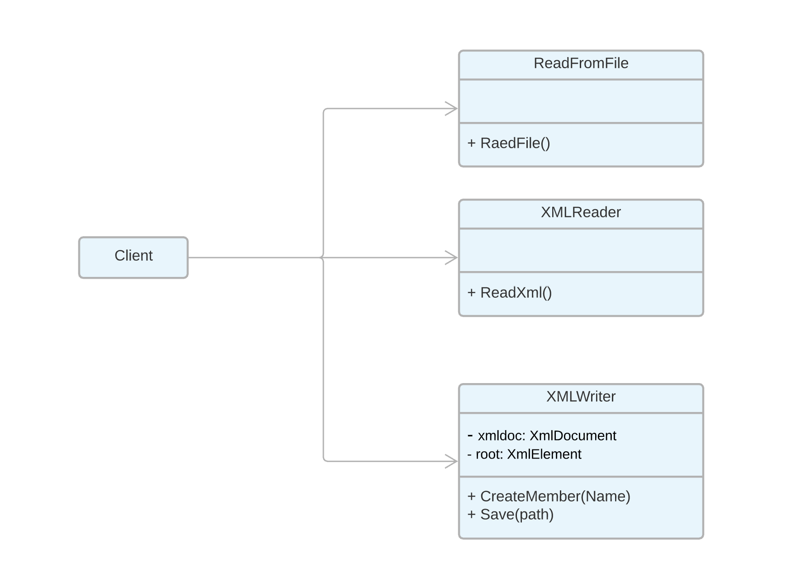

# XmlProject

XML it’s an extensible markup language. This project allows you to write and read XML file that contains information about our team.

## Features

- Write xml file.
- Read xml file.
 - Using threads.
 - Applying Single Responsibility Principle (SRP).
 - Read text file using System.IO Namespace.

## UML

## Authors :

- Yasmin Alghamdi
- Samirah Alhusayni
- Abdulaziz Almohammadi
- Anas Alhomoud
- Riyad Alghamdi